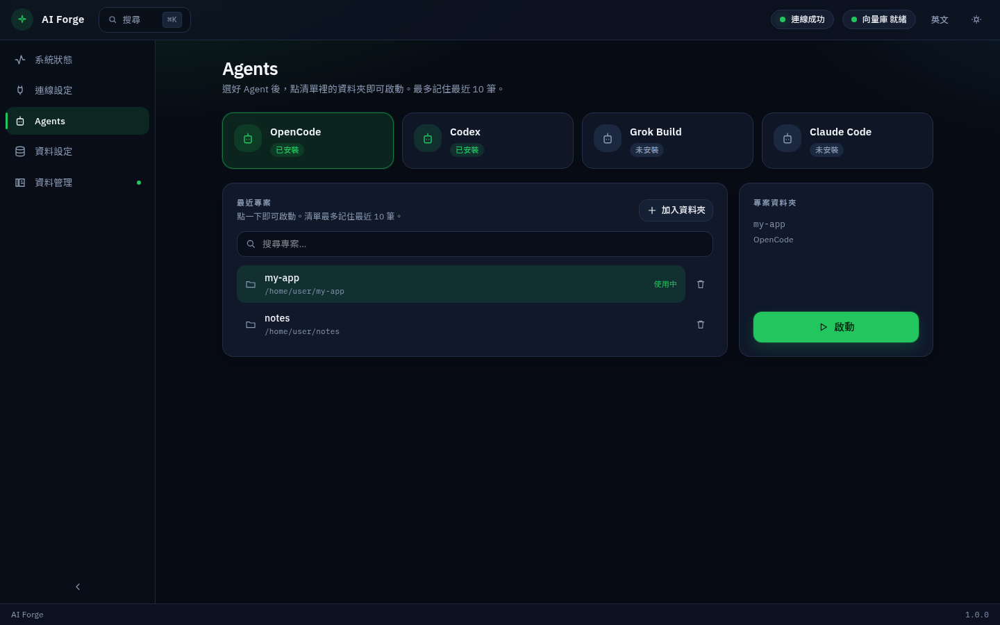

[繁體中文](../zh-TW/agents.md) · **English** · [日本語](../ja/agents.md)

← [Connection](connection.md) · [Contents](README.md) · [Data setup](data.md) →

---
# Agents

Install an assistant and launch it from recent project folders. The list keeps at most 10 shortcuts. Click to open a new window. It does not show in-progress work.

| Assistant | Typical use |
|---|---|
| OpenCode | General coding assistant for most projects |
| Codex | Focused on writing and changing code |
| Grok Build | Another coding assistant with its official installer |
| Claude Code | Conversational edits in a project |

Add a folder, click its name (or **Launch** on the right). Trash removes the shortcut only.

[繁體中文](../zh-TW/agents.md) · **English** · [日本語](../ja/agents.md)

← [Connection](connection.md) · [Contents](README.md) · [Data setup](data.md) →

---
