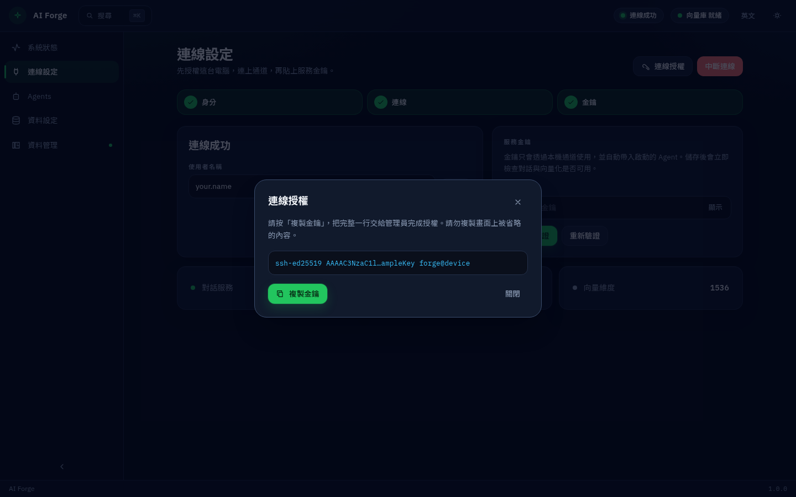
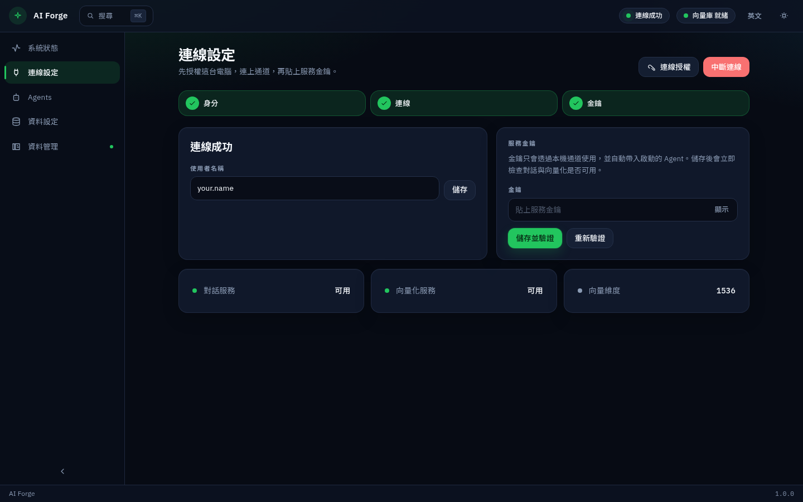

[繁體中文](../zh-TW/first-run.md) · **English** · [日本語](../ja/first-run.md)

← [Install and download](install.md) · [Contents](README.md) · [A few simple ideas](concepts.md) →

---
# First-time setup

Follow the left-hand order: Connection → (optional) Data setup → Agents. The Status screen also points to the next step.

## 1. Save your username

Open **Connection**, enter the username your administrator gave you, and click **Save**.

## 2. Authorize this computer

Click **Authorize**, then **Copy key** (the full line). Send it to your administrator. Come back after they have approved this computer.

## 3. Connect and paste the service key

Click **Connect**. You want the status **Connected**. Paste the service key and click **Save and verify**. Conversation and document understanding should both show as available.

## 4. Install the local store (recommended)

A prompt may appear the first time. Choose **Install**, or later from **Data setup**.

## 5. Launch your first assistant

Open **Agents**, pick an assistant, add a project folder, and click to launch. See [Agents](agents.md).

[繁體中文](../zh-TW/first-run.md) · **English** · [日本語](../ja/first-run.md)

← [Install and download](install.md) · [Contents](README.md) · [A few simple ideas](concepts.md) →

---
