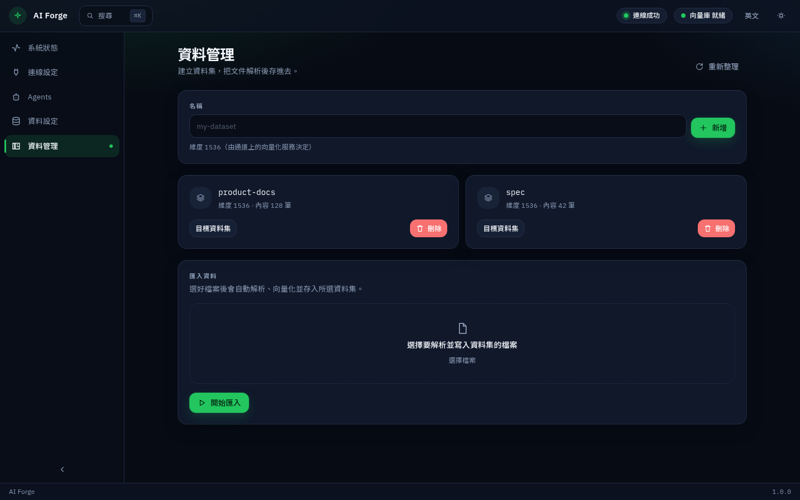

[繁體中文](../zh-TW/library.md) · **English** · [日本語](../ja/library.md)

← [Data setup](data.md) · [Contents](README.md) · [FAQ](faq.md) →

---
# Library

After files are in a dataset, launched assistants can search that content.

Create a dataset, choose it as the target, pick files, and start import. Progress is roughly: parse → understand → store.

Then open [Agents](agents.md) and ask in ordinary language.

[繁體中文](../zh-TW/library.md) · **English** · [日本語](../ja/library.md)

← [Data setup](data.md) · [Contents](README.md) · [FAQ](faq.md) →

---
