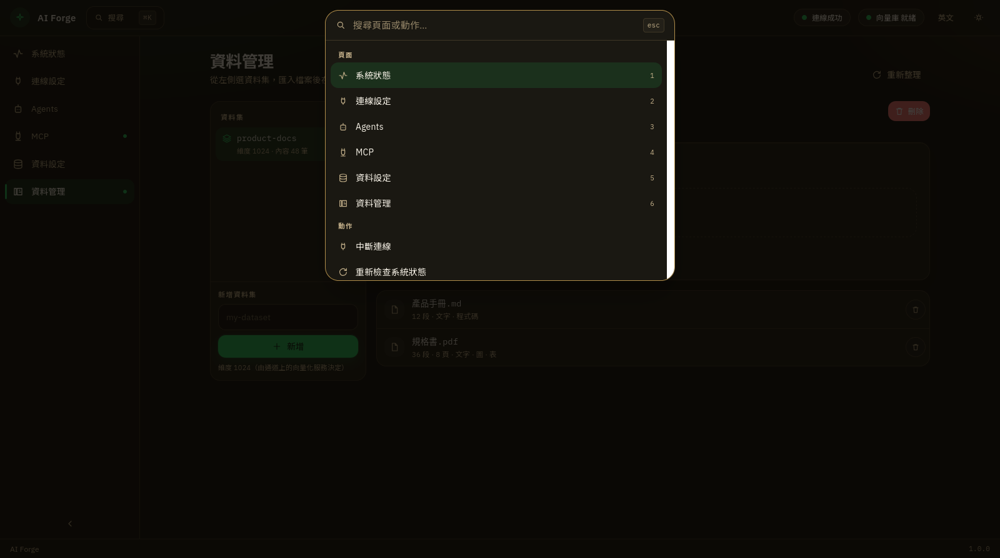

[繁體中文](../zh-TW/install.md) · [English](../en/install.md) · **日本語**

← [目次](README.md) · [目次](README.md) · [初めて使う](first-run.md) →

---
# インストールとダウンロード

[最新の公開ページ](https://github.com/ConGaAI/AI-Forge-SRC/releases/latest) から、お使いのパソコンに合うファイルを選んでください。

| お使いのパソコン | このファイル |
|---|---|
| Windows | `ai-forge-windows-amd64.exe` |
| Mac（Apple 製チップ） | `ai-forge-darwin-arm64` |
| 一般的な Linux | `ai-forge-linux-amd64` |
| ARM 版 Linux | `ai-forge-linux-arm64` |

Windows は `.exe` をダブルクリック。Mac は初回にプライバシーとセキュリティで許可。Linux はプログラムとして実行することを許可します。

開いたあとは、上部でダーク／ライトと中文／English を切り替えられます。ダークは漆黒に金色の枠と説明文です。

`Ctrl+K`（Mac は `⌘K`）で検索。数字キー `1`–`6` で左の六画面（システム状態、接続設定、Agents、MCP、データ設定、データ管理）を切り替えます。画面の検索欄は `⌘K` と出ることがあります。Windows／Linux では `Ctrl+K` です。

続いて [初めて使う](first-run.md) へ。

[繁體中文](../zh-TW/install.md) · [English](../en/install.md) · **日本語**

← [目次](README.md) · [目次](README.md) · [初めて使う](first-run.md) →

---
