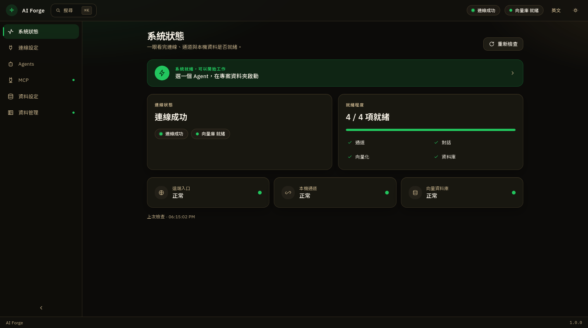

[繁體中文](../zh-TW/status.md) · [English](../en/status.md) · **日本語**

← [かんたんな考え方](concepts.md) · [目次](README.md) · [接続設定](connection.md) →

---
# システム状態

この画面が答えるのは一つです。**今、作業を始めてよいか。**

上部の緑の案内が、今いちばん必要な操作を示します。四つ（通道・對話・向量化・資料庫）が揃うと「系統就緒，可以開始工作」になり、本文は Agents へ誘導します。MCP はこの四項目には入りません。

下の三枚は **遠端入口**、**本機通道**、**向量資料庫** の健康確認です。**重新檢查** で取り直せます。

[繁體中文](../zh-TW/status.md) · [English](../en/status.md) · **日本語**

← [かんたんな考え方](concepts.md) · [目次](README.md) · [接続設定](connection.md) →

---
