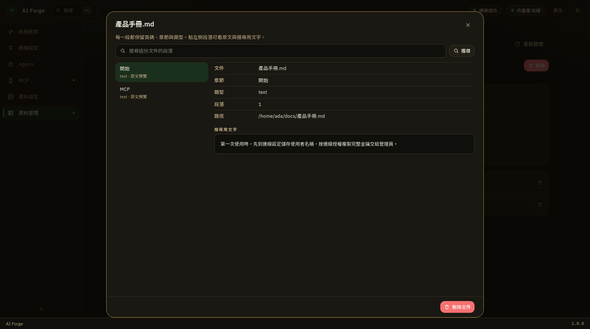

**繁體中文** · [English](../en/library.md) · [日本語](../ja/library.md)

← [資料設定](data.md) · [目錄](README.md) · [常見問題](faq.md) →

---
# 資料管理

把文件放進資料集之後，啟動的助手才能搜尋這些內容。左側選資料集，右側匯入並以**清單**列出檔案。

尚未連線、金鑰未通過向量化驗證、或本機向量資料庫未就緒時，畫面會列出要先完成的步驟，並可直接跳過去。

## 新增資料集

1. 在左側「新增資料集」輸入名稱，例如 `product-docs`。
2. 按 **新增**。

維度由通道上的向量化服務決定，畫面上沒有可改的欄位（會顯示「維度 …（由通道上的向量化服務決定）」）。若之後金鑰對應的服務變了，請改用新的資料集。

右側紅色 **刪除** 會刪掉整個資料集，無法復原。

## 匯入檔案

1. 先在左側選好資料集。
2. 在「加入檔案」區域按一下，等同 **選擇檔案**。
3. 按 **開始匯入**。可按 **清除** 取消已選檔案。

進度四段是：**解析中** → **理解圖片** → **向量化** → **寫入中**。一次可以選多個檔。某個檔失敗時，其他檔仍可能成功。

## 檢視與刪除單一文件

清單每一列可點開 **文件內容**：

1. 左側選段落（保留章節、頁碼、類型）。
2. 上方可 **搜尋** 這份文件的段落。
3. 右側先看中繼資料，再看 **搜尋用文字**。若原文與搜尋用文字不同，才會再顯示 **原文**。
4. 部分格式無法在應用程式內預覽時，會改顯示位置，請到原始檔對照。

列右側垃圾桶或視窗底部的 **刪除文件**，只移除這個資料集裡該檔的所有段落，其他檔不受影響。

## 給助手用時

匯入完成後，到 [MCP](mcp.md) 確認 **本機文件庫** 已啟用並已套用，再到 [Agents](agents.md) 啟動助手，用平常說話的方式問即可。

**繁體中文** · [English](../en/library.md) · [日本語](../ja/library.md)

← [資料設定](data.md) · [目錄](README.md) · [常見問題](faq.md) →

---
