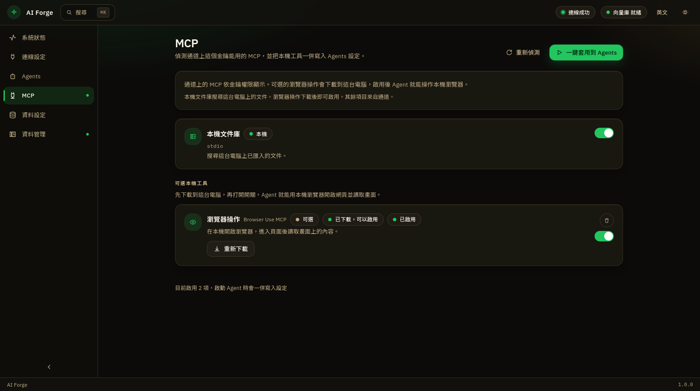

**繁體中文** · [English](../en/mcp.md) · [日本語](../ja/mcp.md)

← [Agents](agents.md) · [目錄](README.md) · [資料設定](data.md) →

---
# MCP

這個畫面偵測通道上「這個金鑰能用的工具」，並把本機工具一併寫進 Agents 設定。連線成功且已儲存服務金鑰後才能完整使用；否則畫面會列出要先完成的步驟。

## 頁面上的按鈕

| 按鈕 | 作用 |
|---|---|
| **重新偵測** | 再向通道查一次可用的服務 |
| **一鍵套用到 Agents** | 把目前啟用的項目寫進助手設定檔。**下次啟動**助手才會用到 |

底部會顯示目前啟用幾項。

## 本機文件庫

標成 **本機**。搜尋這台電腦上已匯入的文件。向量資料庫就緒、且已在 [資料管理](library.md) 匯入檔案後，啟動的助手才能搜到內容。可隨時用開關啟用或停用，再按一鍵套用。

## 可選本機工具：瀏覽器操作

畫面上名稱是 **瀏覽器操作**，旁邊標 **Browser Use MCP**，徽章為 **可選**。

1. 未下載時按 **下載並安裝**，等進度結束。
2. 狀態變成「已下載，可以啟用」後，打開右側開關。
3. 按 **一鍵套用到 Agents**。
4. **重新啟動**助手。之後助手可以在這台電腦開啟瀏覽器、進入頁面並讀取畫面。

已下載時可 **重新下載**。垃圾桶是 **一鍵移除**：只刪這個工具的安裝檔與相關設定，本機文件庫與其他助手不受影響。

若提示請先安裝 Node.js 22 或更新版本，裝好後重開 AI Forge 再下載。

## 通道服務

金鑰通過後，通道上已開放給你的服務會列在這裡，標成 **通道**。沒有權限的項目會顯示 **金鑰無權限**，開關不可用。清單內容依管理員設定而變，不是每位使用者都相同。

**繁體中文** · [English](../en/mcp.md) · [日本語](../ja/mcp.md)

← [Agents](agents.md) · [目錄](README.md) · [資料設定](data.md) →

---
